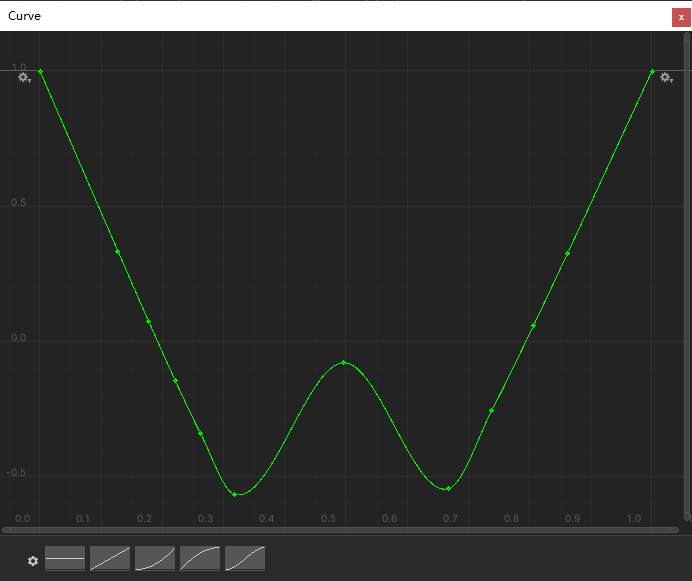
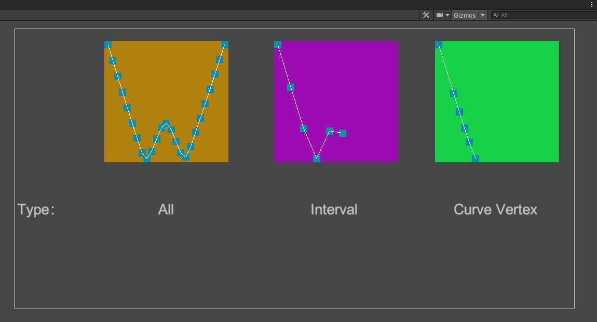
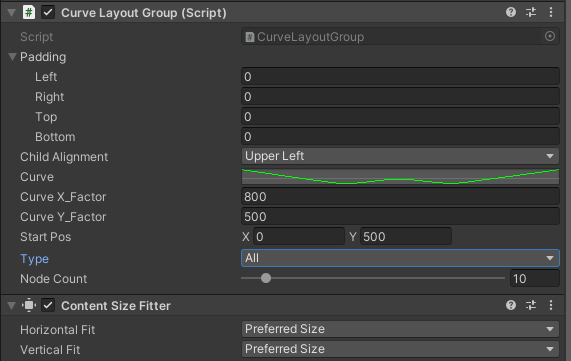

# CurveLayoutGroup
Curve layout component based on unity UGUI.

基于Unity UGUI的曲线控制布局组件。一共有三种模式：全局模式，间隔模式，曲线顶点模式。改组件基于UGUI源码设计，可使用Content Size Fitter自适应父节点的宽度和高度。

## 效果预览

从左到右依次是全局模式，间隔模式，曲线顶点模式的效果，可在项目的`CurveLayoutDemo.unity`场景中查看效果

## 如何使用

`CurveLayoutGroup.cs`

| Property:         | Fuction:                                                     |
| ----------------- | ------------------------------------------------------------ |
| Padding           | 布局组边缘内的填充                                           |
| Child Alignment   | 如果子布局元素没有填满所有可用空间，则要用于它们的对齐方式   |
| Curve             | 控制布局的曲线                                               |
| Curve X_Factor    | 曲线X轴的乘积                                                |
| Curve Y_Factor    | 曲线Y轴的乘积                                                |
| Start Pos         | 控制子节点的初始生成位置，辅助开发者灵活控制子物体位置       |
| Type              | 曲线控制布局的模式                                           |
| Type All          | 子节点们将完整表现出整个曲线的轮廓，子节点越多，填充越多     |
| Type Interval     | 子节点们将按照曲线的Node Count间隔分布  **Tip: 子节点数要小于等于Node Count数量** |
| Type Curve Vertex | 子节点们按照曲线顶点分布  **Tip：子节点数要小于等于曲线顶点数量** |
| Node Count        | **仅仅在间隔模式下有效**  曲线被...个节点等分                |

